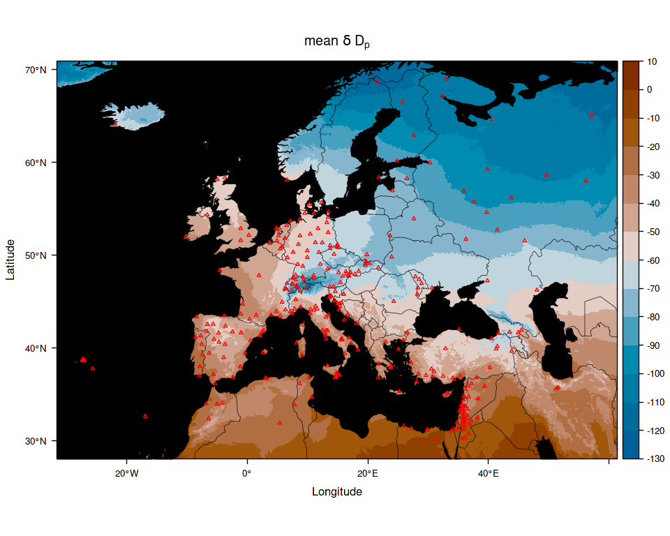

# Welcome!

This is the development repository of __IsoriX__, an R package aiming at building isoscapes using mixed models and inferring the geographic origin of organisms based on their isotopic ratios. 



## How to download and install IsoriX?
You will soon be able to download and install the stable version of IsoriX by typing:

```
#!R
install.packages("IsoriX")
```


You can download and install the development version of IsoriX by typing:

```
#!R
devtools::install_bitbucket("courtiol/IsoriX_project/IsoriX")
```

## How can you contribute?
There are plenty way you can contribute! If you are fluent in R programming, you can improve the code and develop new functions. If you are not so fluent, you can still edit the documentation files to make them more complete and clearer, write new vignettes, report bugs or make feature requests.

## Some useful links

* about making R packages:

[Simple introduction to the making of R packages](http://r-pkgs.had.co.nz/)

[Writing R extensions](https://cran.r-project.org/doc/manuals/r-release/R-exts.html)

[R coding standard](https://google.github.io/styleguide/Rguide.xml)

* about the environment to develop IsoriX:

[Learning git](https://www.atlassian.com/git/tutorials/)

[Using version control in RStudio](https://support.rstudio.com/hc/en-us/articles/200532077-Version-Control-with-Git-and-SVN)

[Markdown in Bitbucket](https://bitbucket.org/tutorials/markdowndemo)

* about other R packages on which IsoriX strongly depends:

[The R package spaMM](http://kimura.univ-montp2.fr/~rousset/spaMM.htm)

[The R package rasterVis](https://oscarperpinan.github.io/rastervis/)

## Authors
* Alexandre Courtiol
* Stephanie Kramer-Schadt
* François Rousset